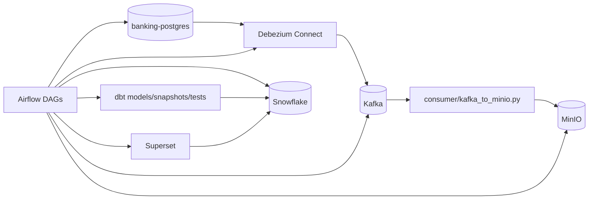
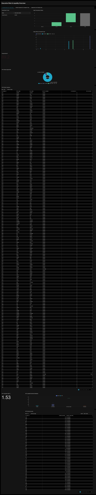
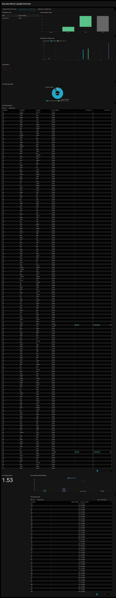
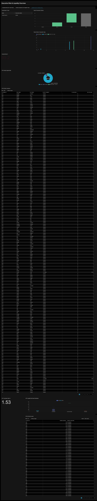

# Realtime-Banking-Modern-Datastack

End-to-end local data stack for a banking use case using Docker services and Airflow orchestration.  
It generates OLTP data, streams CDC events, lands parquet files, builds dbt models in Snowflake, and prepares Superset datasets/views.

## Table of contents

- [What this repo does?](#what-this-repo-does)
- [Architecture and Data Flow](#architecture-and-data-flow)
- [Tech Stack](#tech-stack)
- [Possible Tools to Confirm](#possible-tools-to-confirm)
- [Project Structure](#project-structure)
- [Setup and Run](#setup-and-run)
- [Environment Variables](#environment-variables)
- [Pipeline or App Usage](#pipeline-or-app-usage)
- [Data Model](#data-model)
- [Data Quality and Tests](#data-quality-and-tests)
- [CI](#ci)
- [Documentation and Screenshots to Add](#documentation-and-screenshots-to-add)
- [Troubleshooting](#troubleshooting)
- [Roadmap](#roadmap)

## What this Repo Does?

- Runs a local stack with Docker Compose (`docker-compose.yaml`).
- Runs Apache Airflow DAGs from [`docker/dags`](docker/dags).
- Generates synthetic banking records into Postgres with [`data-generator/faker_generator.py`](data-generator/faker_generator.py).
- Creates/updates a Debezium Postgres connector via [`kafka-debezium/generate_and_post_connector.py`](kafka-debezium/generate_and_post_connector.py).
- Consumes Debezium Kafka topics and writes parquet batches to MinIO via [`consumer/kafka_to_minio.py`](consumer/kafka_to_minio.py).
- Loads MinIO parquet files into Snowflake via DAG [`docker/dags/minio_to_snowflake_dag.py`](docker/dags/minio_to_snowflake_dag.py).
- Runs dbt staging, snapshots, marts, and tests via DAG [`docker/dags/scd_snapshots.py`](docker/dags/scd_snapshots.py).
- Creates Snowflake BI views and provisions Superset datasets via DAG [`docker/dags/superset_business_automation.py`](docker/dags/superset_business_automation.py).
- Publishes Docker images to GHCR with GitHub Actions (`.github/workflows/cd.yml`).

## Architecture and Data Flow


### Data Architecture Sketch


### Airflow DAG Lineage


### DBT Lineage


### Apache Superset Dashboard Screenshots






### Snowflake Data Preview

`docs/images/snowflake-data-preview.png`


Hint: worksheet preview of key tables/views (for example `ANALYTICS.DIM_ACCOUNTS` or BI views).

## Tech Stack

| Tool | Role in this repo | Verified from |
|---|---|---|
| Docker Compose | Local orchestration of all services | [`docker-compose.yaml`](docker-compose.yaml) |
| Apache Airflow 3.1.7 | Pipeline orchestration (scheduler, worker, triggerer, API server) | [`docker-compose.yaml`](docker-compose.yaml), [`dockerfile-airflow.dockerfile`](dockerfile-airflow.dockerfile) |
| PostgreSQL 16 | Airflow metadata DB and banking OLTP source DB | [`docker-compose.yaml`](docker-compose.yaml), [`docker/postgres/schema.sql`](docker/postgres/schema.sql) |
| Redis | Celery broker/backend support for Airflow | [`docker-compose.yaml`](docker-compose.yaml) |
| Kafka + Zookeeper | CDC event transport | [`docker-compose.yaml`](docker-compose.yaml) |
| Debezium Connect 2.2 | PostgreSQL CDC connector | [`docker-compose.yaml`](docker-compose.yaml), [`kafka-debezium/generate_and_post_connector.py`](kafka-debezium/generate_and_post_connector.py) |
| MinIO | Object storage landing zone for parquet files | [`docker-compose.yaml`](docker-compose.yaml), [`consumer/kafka_to_minio.py`](consumer/kafka_to_minio.py) |
| Snowflake | Warehouse target for landed data and marts | [`docker/dags/minio_to_snowflake_dag.py`](docker/dags/minio_to_snowflake_dag.py), [`banking_dbt/profiles.yml`](banking_dbt/profiles.yml) |
| dbt Core + dbt-snowflake | Transformations, snapshots, and tests | [`banking_dbt/dbt_project.yml`](banking_dbt/dbt_project.yml), [`docker/dags/scd_snapshots.py`](docker/dags/scd_snapshots.py) |
| Apache Superset | BI layer and dataset provisioning | [`docker-compose.yaml`](docker-compose.yaml), [`docker/dags/superset_business_automation.py`](docker/dags/superset_business_automation.py) |
| Python 3.12 | Script runtime and tests | [`pyproject.toml`](pyproject.toml), `.github/workflows/ci.yml` |
| GitHub Actions | CI and container CD | [`.github/workflows/ci.yml`](.github/workflows/ci.yml), [`.github/workflows/cd.yml`](.github/workflows/cd.yml) |

## Possible Tools to Confirm

- TODO: confirm if runtime data directories in `docker/minio/data` and `docker/postgres/data` are intended to be committed in this branch snapshot.
- TODO: confirm if `docker/postgres/schema.sql` is executed automatically or needs a manual init step.

## Project Structure

```text
.
+- .github/
¦  +- workflows/
¦     +- ci.yml
¦     +- cd.yml
+- docker-compose.yaml
+- dockerfile-airflow.dockerfile
+- dockerfile-superset.dockerfile
+- .env.example
+- CONTRIBUTING.md
+- banking_dbt/
¦  +- dbt_project.yml
¦  +- profiles.yml
¦  +- models/
¦  ¦  +- sources.yml
¦  ¦  +- staging/
¦  ¦  +- marts/
¦  +- snapshots/
¦  +- tests/
+- docker/
¦  +- dags/
¦  ¦  +- banking_end_to_end_flow.py
¦  ¦  +- minio_to_snowflake_dag.py
¦  ¦  +- scd_snapshots.py
¦  ¦  +- superset_business_automation.py
¦  ¦  +- .env.example
¦  ¦  +- README.md
¦  +- postgres/
¦     +- schema.sql
+- data-generator/
¦  +- faker_generator.py
¦  +- .env.example
¦  +- README.md
+- consumer/
¦  +- kafka_to_minio.py
¦  +- .env.example
¦  +- README.md
+- kafka-debezium/
¦  +- generate_and_post_connector.py
¦  +- .env.example
¦  +- README.md
+- tests/
   +- unit/
      +- test_faker_generator_helpers.py
      +- test_generate_and_post_connector_helpers.py
```

## Setup and Run

### Prerequisites

- Docker and Docker Compose (required by [`docker-compose.yaml`](docker-compose.yaml)).
- Python 3.12 (required by [`pyproject.toml`](pyproject.toml)) if you run scripts/tests outside containers.

### Quick Start

- Copy env Templates:
```powershell
Copy-Item .env.example .env
Copy-Item data-generator/.env.example data-generator/.env
Copy-Item consumer/.env.example consumer/.env
Copy-Item kafka-debezium/.env.example kafka-debezium/.env
Copy-Item docker/dags/.env.example docker/dags/.env
```

- Start Stack:
```powershell
docker compose down
docker compose up -d --build
docker compose ps
```

- Validate Airflow DAG Availability:
```powershell
docker compose exec airflow-scheduler airflow dags list
```

- Trigger Parent Pipeline:
```powershell
docker compose exec airflow-scheduler airflow dags trigger banking_end_to_end_flow
```

## Environment Variables

This repo uses multiple `.env` scopes. Secrets are not committed by default (`.gitignore` ignores `.env*` except `.env.example`).

### Root `.env.example` (stack level)

```env
AIRFLOW_UID=50000
POSTGRES_USER=postgres
POSTGRES_PASSWORD=postgres
POSTGRES_DB=banking
MINIO_ROOT_USER=minioadmin
MINIO_ROOT_PASSWORD=minioadmin
DBT_QUALITY_WARN_THRESHOLD=50
SUPERSET_SECRET_KEY=replace-with-long-random-string
SUPERSET_ADMIN_USERNAME=admin
SUPERSET_ADMIN_PASSWORD=admin
SUPERSET_ADMIN_FIRSTNAME=Superset
SUPERSET_ADMIN_LASTNAME=Admin
SUPERSET_ADMIN_EMAIL=admin@example.com
```

### Component env Templates

- `data-generator/.env.example`: Postgres connection + `GEN_*` profile knobs.
- `consumer/.env.example`: Kafka + MinIO consumer settings.
- `kafka-debezium/.env.example`: connector script settings.
- `docker/dags/.env.example`: MinIO, Snowflake, and Superset DAG runtime settings.

### Additional Variables Referenced in Code/compose

These are referenced in repo code or compose interpolation and may be optional defaults:

- `ENV_FILE_PATH`
- `_AIRFLOW_WWW_USER_USERNAME`
- `_AIRFLOW_WWW_USER_PASSWORD`
- `DBT_SNOWFLAKE_ACCOUNT`, `DBT_SNOWFLAKE_USER`, `DBT_SNOWFLAKE_PASSWORD`, `DBT_SNOWFLAKE_ROLE`, `DBT_SNOWFLAKE_WAREHOUSE`, `DBT_SNOWFLAKE_DB`, `DBT_SNOWFLAKE_SCHEMA`, `DBT_THREADS`
- `SNOWFLAKE_ROLE`
- `DBT_BP3_MAX_OVERDRAWN_RATE_PCT`
- `DBT_BP3_MAX_OVERDRAFT_EXPOSURE`
- `DATA_GENERATOR_ENV_FILE`
- `DEBEZIUM_CONNECTOR_NAME`
- `DEBEZIUM_CONNECT_URL`

### Secrets Handling

- `banking_dbt/profiles.yml` reads Snowflake credentials from env vars only.
- CI includes guards against hardcoded dbt credentials in `profiles.yml`.
- `.gitignore` excludes `.env` files and common key/cert extensions.

## Pipeline or App usage

### Main orchestrated pipeline (Airflow)

Parent DAG: `banking_end_to_end_flow` in [`docker/dags/banking_end_to_end_flow.py`](docker/dags/banking_end_to_end_flow.py)

Execution Chain:

1. `wait_for_kafka`
2. `wait_for_debezium_connect`
3. `ensure_debezium_connector`
4. `wait_for_minio`
5. `generate_fake_data_once`
6. `consume_kafka_to_minio`
7. `trigger_minio_to_snowflake` (child DAG: `minio_to_snowflake_banking`)
8. `trigger_dbt_pipeline` (child DAG: `banking_realtime_dbt`)
9. `trigger_superset_automation` (child DAG: `superset_business_automation`)

Trigger Command:

```powershell
docker compose exec airflow-scheduler airflow dags trigger banking_end_to_end_flow
```

### Script Entrypoints

- Data Generator:
```powershell
python data-generator/faker_generator.py --once --iterations 1
```

- Kafka Consumer to MinIO:
```powershell
python consumer/kafka_to_minio.py --max-runtime-seconds 300 --max-idle-cycles 3
```

- Debezium Connector Helper:
```powershell
python kafka-debezium/generate_and_post_connector.py
```

## Data Model

### OLTP Source Schema

Defined in [`docker/postgres/schema.sql`](docker/postgres/schema.sql):

- `customers`
- `accounts`
- `transactions`

### DBT Raw Sources

Defined in [`banking_dbt/models/sources.yml`](banking_dbt/models/sources.yml):

- `BANKING.RAW.customers`
- `BANKING.RAW.accounts`
- `BANKING.RAW.transactions`

### DBT Models

- Staging Views:
  - `stg_customers`
  - `stg_accounts`
  - `stg_transactions`
- Snapshots:
  - `customers_snapshot`
  - `accounts_snapshot`
- Marts:
  - `dim_customers` (table)
  - `dim_accounts` (table)
  - `fact_transactions` (incremental)

### Superset BI Views Created by DAG

From [`docker/dags/superset_business_automation.py`](docker/dags/superset_business_automation.py):

- `ANALYTICS.BI_BP1_TRANSACTION_RISK_DAILY`
- `ANALYTICS.BI_BP2_CUSTOMER_VALUE_SEGMENTS`
- `ANALYTICS.BI_BP3_LIQUIDITY_RISK_ACCOUNTS`

## Data Quality and Tests

### Unit Tests (Python helpers)

Run:

```powershell
python -m unittest discover -s tests/unit -p "test_*.py" -v
```

Coverage in repo:

- [`tests/unit/test_faker_generator_helpers.py`](tests/unit/test_faker_generator_helpers.py)
- [`tests/unit/test_generate_and_post_connector_helpers.py`](tests/unit/test_generate_and_post_connector_helpers.py)

### DBT Tests

Defined in [`banking_dbt/tests`](banking_dbt/tests) and model YAML tests.

Run via DAG (`banking_realtime_dbt`) steps:

- `dbt test --select tag:critical`
- `dbt test --select tag:quality`
- quality summary parser reads `banking_dbt/target/run_results.json`

### Great Expectations

- TODO: Great Expectations is not present in this repo snapshot.

## CI

### CI Workflow

File: [`.github/workflows/ci.yml`](.github/workflows/ci.yml)

Checks:

- Docker Compose config validation.
- Python syntax compilation for tracked `.py` files.
- dbt project structure checks.
- Guardrails against hardcoded dbt credentials.
- Guardrails against committed runtime state paths.

### CD Workflow

File: [`.github/workflows/cd.yml`](.github/workflows/cd.yml)

Publishes images to GHCR:

- `ghcr.io/<owner>/banking-airflow`
- `ghcr.io/<owner>/banking-superset`

Trigger:

- push to `main`
- tags matching `v*.*.*`
- manual dispatch

Required secrets referenced:

- `GHCR_TOKEN` (used for GHCR login in workflow)

### GitHub Repository Settings

Configure these settings in GitHub for stable CI/CD:

- `Settings -> Actions -> General -> Workflow permissions`: set to `Read and write permissions`.
- `Settings -> Branches`: add branch protection for `main`.
- Enable `Require a pull request before merging`.
- Enable `Require status checks to pass before merging` and select CI checks from workflow `CI` (for example job `validate`).

### Verify Published Images

After CD succeeds, confirm package tags exist in GHCR:

- `ghcr.io/jbaguio27/banking-airflow`
- `ghcr.io/jbaguio27/banking-superset`

GitHub Packages page:

- `https://github.com/users/jbaguio27/packages`

## Documentation and screenshots to add

- [ ] Architecture diagram  
  Hint: end-to-end component graph with data contracts and ports.
- [ ] Airflow DAG screenshot  
  Hint: Graph view for `banking_end_to_end_flow`.
- [ ] dbt lineage screenshot  
  Hint: `stg_*` -> snapshots -> dims/fact lineage.
- [ ] Data dictionary or KPI doc  
  Hint: explain BI view columns and KPI formulas.
- [ ] Data quality report screenshot  
  Hint: dbt test output or run summary from `run_results.json`.
- [ ] CI run screenshot  
  Hint: successful GitHub Actions run showing CI and CD.
- [ ] BI dashboard screenshot  
  Hint: Superset charts using BI BP1/BP2/BP3 views.

## Troubleshooting

- `airflow dags list` does not show expected DAGs  
  Check `docker/dags` mount in `docker-compose.yaml` and container health.

- `generate_and_post_connector.py` prints missing env var  
  Ensure `POSTGRES_USER`, `POSTGRES_PASSWORD`, and `POSTGRES_DB` are set in `kafka-debezium/.env` or process env.

- Debezium connector is not `RUNNING`  
  Verify `connect` service and Postgres logical replication settings (`wal_level=logical`, replication slots).

- Consumer exits with `MINIO_BUCKET is not set`  
  Set `MINIO_BUCKET` in `consumer/.env`.

- Consumer cannot reach Kafka/MinIO  
  Use host values (`localhost:29092`, `http://localhost:9000`) for host-run, or container DNS values for in-network runs.

- MinIO to Snowflake DAG fails with missing env vars  
  Fill `docker/dags/.env` Snowflake and MinIO keys required by `_validate_runtime_config()`.

- dbt tasks fail with Snowflake auth/profile errors  
  Confirm env values used by `banking_dbt/profiles.yml` (`DBT_SNOWFLAKE_*` or `SNOWFLAKE_*`).

- Quality gate fails on warn threshold  
  Adjust `DBT_QUALITY_WARN_THRESHOLD` (root `.env`) or fix underlying quality warnings.

- Superset provisioning fails (`login`, CSRF, dataset create)  
  Verify `SUPERSET_API_USERNAME`, `SUPERSET_API_PASSWORD`, and `SUPERSET_URL` in `docker/dags/.env`.

- Overdrawn seeding warning appears in generator  
  `accounts.balance` has `CHECK (balance >= 0)` in [`docker/postgres/schema.sql`](docker/postgres/schema.sql).  
  Set `GEN_ALLOW_OVERDRAWN=false` or adjust schema intentionally.

## Roadmap

- [ ] TODO: wire `docker/postgres/schema.sql` into automatic DB initialization in Compose.
- [ ] TODO: add integration test job that exercises one full DAG run in CI.
- [ ] TODO: add a deterministic seed mode for data generator to improve test reproducibility.
- [ ] TODO: add a scripted bootstrap command for local setup (single command wrapper).
- [ ] TODO: add dbt docs generation and publish artifacts from CI.
- [ ] TODO: add explicit schema/table contracts for RAW and ANALYTICS layers.
- [ ] TODO: add alerting/notifications for DAG failures (Slack/email/webhook).
- [ ] TODO: pin `apache/superset` image tag in `dockerfile-superset.dockerfile` instead of `latest`.
- [ ] TODO: add rollback/recovery runbook for failed downstream loads.
- [ ] TODO: add a formal data quality SLA document for critical vs quality tests.
